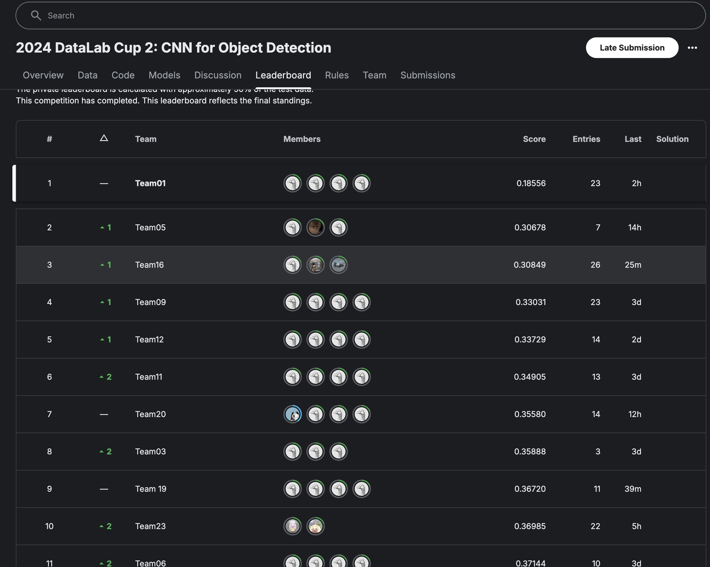

# cup02

## Environment

[Install Conda](https://docs.anaconda.com/miniconda/)

```bash
conda create -n cup2 python=3.10
conda activate cup2
conda install pytorch torchvision torchaudio pytorch-cuda=12.1 -c pytorch -c nvidia
# Currently pytorch==2.5.1 torchvision==0.20.1 torchaudio==2.5.1
pip install -r requirements.txt
```

## Scoreboard


